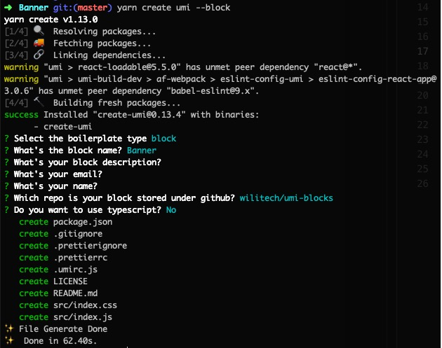

# umi-blocks
业务区块整合

## 新建区块

1. 安装 [umi](https://umijs.org/zh/guide/getting-started.html#%E7%8E%AF%E5%A2%83%E5%87%86%E5%A4%87)
2. 在本项目根目录创建区块文件夹
3. 进入区块文件夹，执行命令`yarn create umi`
    * 模板类型选择 `block`
    * github 仓库地址填写 `wilitech/umi-blocks`
    * 选择不启用 TS
    * 目前 umi 版本还需要手动在 package.json 添加[版本兼容配置项](https://github.com/umijs/umi/pull/2367)
      ```
      "blockConfig": {
        "specVersion": "0.1"
      }
      ```




